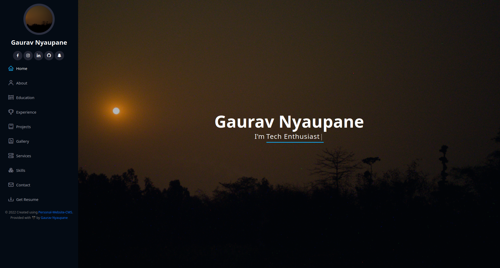
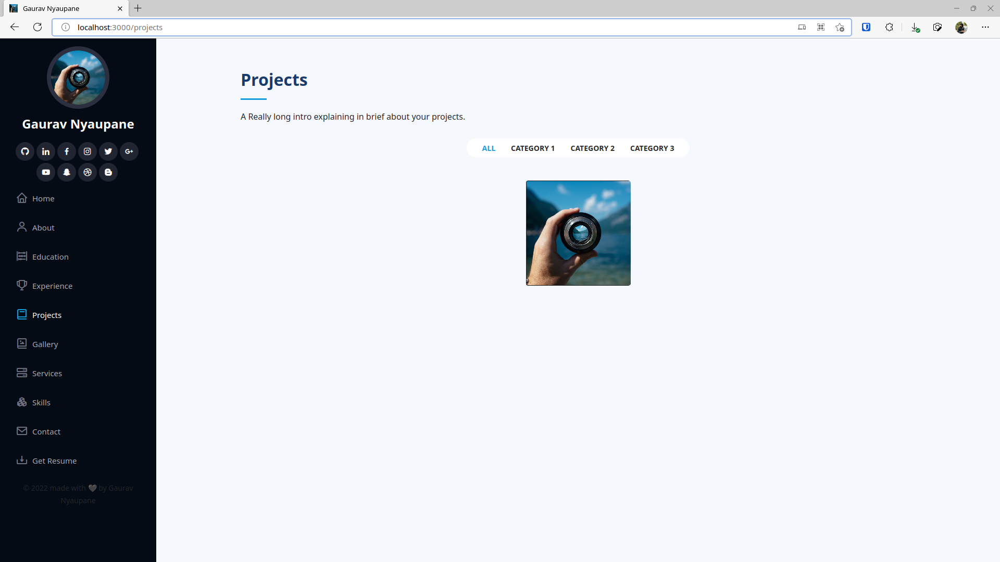
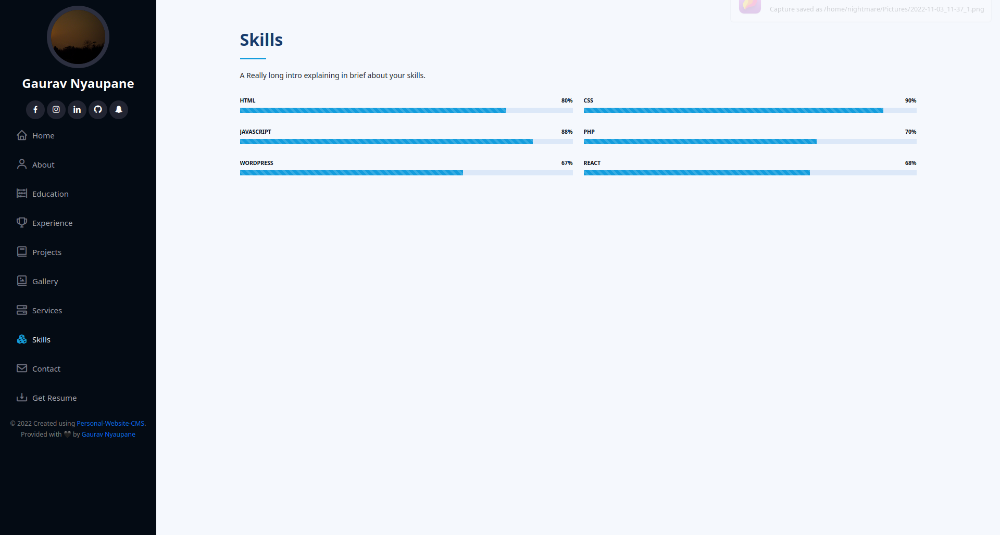

# Statically hosted dynamic personal website

This project runs using client side technology so that it can also be hosted on a server that can only host static websites. It uses JSON api to make things Dynamic(Kind of).
 
If you are not reading this from the `Personal-Website-Client` Repository of `NightmareGaurav`, then follow this <a href="https://github.com/nightmaregaurav/personal-website-client">link</a>.

|  |  |
|:----------:|:----------:|

## Installation
### On GitHub pages
1. Fork the repository, preferably with name `{your-username}.github.io`
2. Go to settings and enable GitHub pages
3. Change path of main static files (css and js) in `index.html` to match your hosting path IE: `{your website root}`
4. Change line `let home = "";` in `404.html` to `let home = "{YOUR HOME URL in github page}"` if you are using path other than / as root, normally happens when you are not using custom domain 
5. Copy `config.dist.json` as `config.json`
6. Change the data in `config.json` to match your data (Read `config-info.json` to understand the data type and format, Read "How to understand `config-info.json`?" section to understand `config-info.json`)
7. Add CNAME and change the domain name to your domain name or setup domain name from your repo setting 
8. Visit `https://{your-website-root}/gh-sitemap` to generate sitemap 
9. Copy all content of sitemap and save as `sitemap.xml`
### On your own server
1. Clone the repository 
2. Change path of main static files (css and js) in `index.html` to match your hosting path IE: `{your website root}`
3. Change line `let home = "";` in `404.html` to `let home = "{YOUR HOME URL}"` if you are using path other than / as root 
4. Copy `config.dist.json` as `config.json`
5. Change the data in `config.json` to match your data (Read `config-info.json` to understand the data type and format, Read "How to understand `config-info.json`?" section to understand `config-info.json`)
6. Visit `https://{your-website-root}/get-sitemap` to generate sitemap 
7. Copy all content of sitemap and save as `sitemap.xml`
### How to understand `config-info.json`?
1. `config-info.json` explain the data format for `config.json` that is used to generate the website.
2. `config-info.json` has same keys as `config.json` but the values are in the format `[{DATATYPE}, {CARDINALITY}, {INFO}, {EXAMPLE}]`.
3. `DATATYPE` can be `STRING`, `OBJECT`, `NUMBER`, `URL`, `IMAGE URL`, `ARRAY OF {DATATYPE}`
   1. `STRING` is a plain string
   2. `OBJECT` is an object that may have more Key/Value pairs
   3. `NUMBER` is a plain number
   4. `URL` is a valid URL
   5. `IMAGE URL` is a valid URL that points to a raw image
   6. `ARRAY OF {DATATYPE}` is an array of {DATATYPE}
4. `CARDINALITY` can be `Compulsory`, `Optional`, `At Least One`
   1. `Compulsory` means that the data is compulsory to be present in the `config.json` if parent is present.
   2. `Optional` means that the data is optional to be present in the `config.json` even if parent is present.
   3. `At Least One` means that at least one of the data is compulsory to be present in the `config.json` if parent is present.
   4. For `Optional` `ARRAY OF {DATATYPE}` if you wish not to add any data, then add `[]` IE: Empty array 
5. `INFO` is a description of the data
6. `EXAMPLE` is a real example of the data to put in `config.json`

<b> It is recommended that you DO NOT add/modify any other files than specified above in the repository. As they may get overridden or prevent updates. If you need to serve static files (For example to serve images and provide url in 'config.json' you can do so is 'data' folder in the root of the repo) </b>

## Maintenance
1. Update `config.json`
2. Update `sitemap.xml` using previous steps if you added or removed projects or enabled/disabled gallery

## Upgrade
1. Pull from upstream or Sync fork
2. Update `config.json` if there are any changes in `config.dist.json` or `config-info.json`
3. Update `sitemap.xml` if needed
4. Perform step 3 & 4 of `installation > On GitHub pages` if you are using GitHub pages
5. Perform step 2 & 3 of `installation > On your own server` if you are hosting it on you own server.

## Features
* Completely dynamic setup.
* Dynamic content is generated on the fly.
* Dynamic content is generated using JSON api.
* Fast and easy to use.
* Cheap to host static project on a server. Many trusted free hosts are also available.
* Complete customization.

---

## Note
- Project is Licensed under GNU GPLv3.

### Which means Anyone are permitted for:
- Commercial use: **The licensed material and derivatives may be used for commercial purposes.**
- Distribution: **The licensed material may be distributed.**
- Modification: **The licensed material may be modified.**
- Patent use: **This license provides an express grant of patent rights from contributors.**
- Private use **The licensed material may be used and modified in private.**

### Under Condition that:
- Disclose source: **Source code must be made available when the licensed material is distributed.**
- License and copyright notice: **A copy of the license and copyright notice must be included with the licensed material.**
- Same license: **Modifications must be released under the same license when distributing the licensed material. In some cases a similar or related license may be used.**
- State changes: **Changes made to the licensed material must be documented. Along with link to original source**

---
Currently, not open For contribution. Issues and Suggestions are welcomed
---
